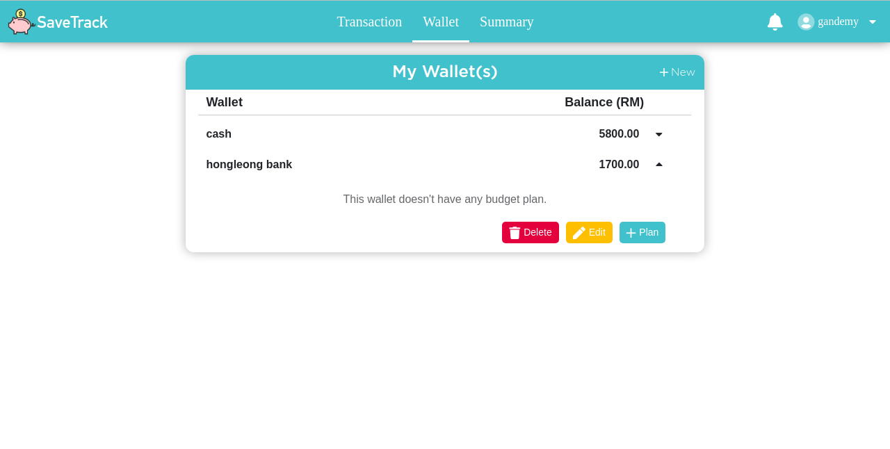

# Money Tracker 
Diploma Final Year Project 

it allows family to record their cashflow income and expense.

Parent can assign wallet and money to their child and parent can do tracking on their child expense

The project built with MySQL and pure PHP

## Feature
- CRUD expense, income, wallet, budget, family member
- Summary Chartjs implementation
 
 
 
 
 
 
 
 